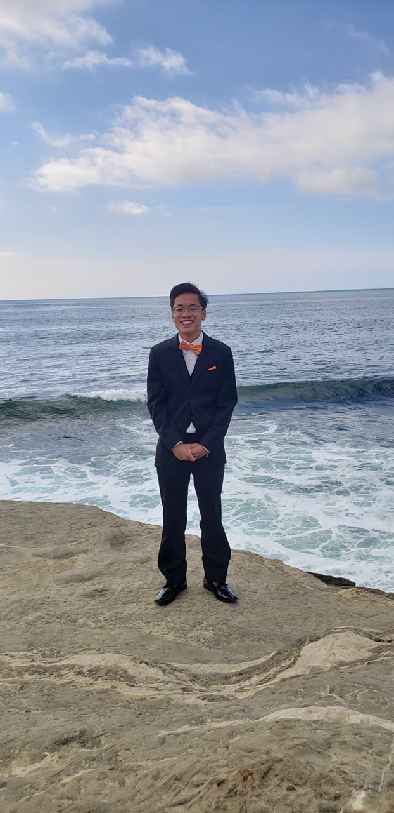
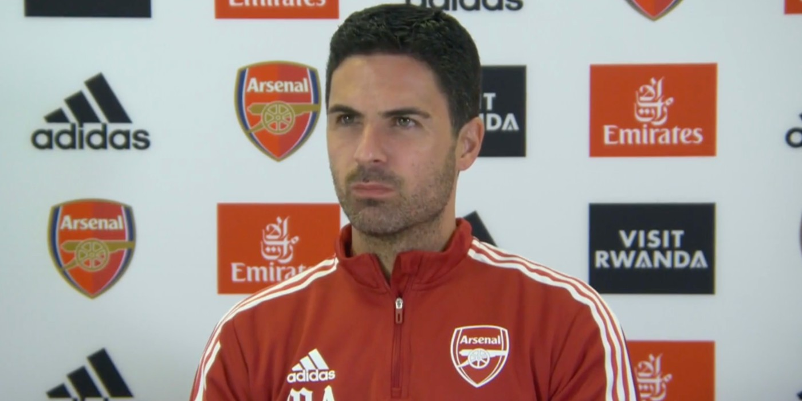

# Nico's page



## Table of Contents
[Introduction](#introduction)\
[Work + Class Experience](#work--class-experience)\
[Interests + Hobbies](#interests--hobbies)


## Introduction 
Hello! I am a third year student pursuing a Bachelor's in Computer Science and a Business minor. I love working on a team, and I am prepared to further my leadership by learning from others. I am interested in various fields, such as software, data, and finance.  I am excited for this class, and especially to work in React!


In the words of ***my favorite*** manager Mikel Arteta: 
> It's a project we believed in and we all take responsibility.  Now we have to make it work.


## Work + Class Experience
This past summer I worked at Glassdoor as an intern.  I had a great experience and I hope that the skills I picked up there will also transfer over to this class.  In addition, I've loved many of my computer science courses that I have taken so far as I feel I have learned a great amount and have had smooth transitions with it so far.  To quickly encapsulate some of my course experience, I have made some lists as a screenshot of my work.

Some professors I have taken so far: 
- Niema Moshiri
- Leo Porter
- Sanjoy Dasgupta

My 3 most used languages in order:
1. Java
2. JavaScript
3. Python

Example JavaScript Code:
```
console.log('Hello World!');
```

Tasks so far for CSE 110:
- [X] Attend first lecture
- [ ] Finish first lab
- [ ] Fill out survey and meet new teammates

## Interests + Hobbies
Outside of class and work, I enjoy playing sports like ping pong, basketball, football, and mini golf.  I also enjoy watching sports my favorites being NBA, NFL, Premier League, and tennis.  My favorite teams are the Hornets, Panthers, and Arsenal.  

Additional links to check out: 
Another site I made [here](http://nvanny.github.io/personal-website)\
README for this repo [here](README.md)